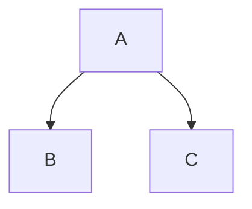

# Change Log
All notable changes to this project will be documented in this file.

The format is based on [Keep a Changelog](http://keepachangelog.com/)
and this project adheres to [Semantic Versioning](http://semver.org/).

## [2.5.4]
### Changed
 - `Arguments info:` renamed to `Paramters`

### Added
 - constructor's parameters description added (as for other functions/methods)

## [2.5.3]
### Fixed
- `Arguments info:` section for function parameters now contains all attributes, even ones without description 
  
## [2.5.2]
### Fixed
 - output all types for parameters with multiple type: `@param {number|string} a` -> `a: number | string`; 
  before this fix only first type is included `a: number`
   
## [2.5.1]
### Fixed
 - fix #11:
   - in case `templates.buildInURL` or `templates.buildins` is not defined in config - skip creation of href for build-in types
   - `{@link` replacer will ignore non-string parameters (as reported in #11 `param.description` can be a non-string)
   
## [2.5.0]
### Fixed
 - process exit with exit code 1 in case on errors in rendering process
 - for function with wrong returns definition add a "->[wrong jsdoc]" in the end.
   This fix "slice of undefined" error during render

### Added
 - permalink added for all headers. This helps to share a link to a specific part of the documentation
 - in `--verbose` mode cli output a file/class what renders. This helps to find a bug in sources documentation
 - a [mermaid](http://mermaid-js.github.io/mermaid/#/) plugin is added. Can be used by adding a code block of `mermaid`
   type in the md file. Example: 
<pre>

</pre>
  Such blocks are rendered in SVG on runtime.

### Changed
 - badges (opt, inherits etc) now small (.5em) and top-aligned
 - all dependencies are updated to the up-to-date versions 

## [2.4.2]
### Changed
 - more accurate applying styles from gitbook

## [2.4.0]
### Added
 - CSS styles from gitbook (.markdown-section class from <https://indigo-iam.github.io/docs/v/current/gitbook/style.css>) to make nicer page view
 
### Changed
 - SQL code highlighting added (prism) 

## [2.3.4]
### Fixed
 - set year and month for index page in changelog correctly
 - correct names in methods arguments with 3-level nesting

## [2.3.3]
### Fixed
 - index page in changelog filled correctly

## [2.3.2]
### Added
 - ordering for packages in changelog 
### Changed
 - index page in changelog now copy of current month changelog page 

## [2.3.1]
### Added
 - index page for changelog generator

## [2.3.0]
### Added
 - changelog page generator
### Changed
 - update all dependencies

## [2.2.0]
### Added
 - code highlight to json5, bash/shell (by updating prism.js)
### Changed
 - update all dependencies

## [2.1.12]
### Fixed
 - Getting started image path

## [2.1.11]
### Fixed
 - Сan scroll the search results

## [2.1.10]
### Fixed
 - Show examples in members instead only in methods 

## [2.1.9]
### Fixed
 - Correct update image from tutorials
 - Change shell executor to cross-platform in gettingStarted

## [2.1.8]
### Fixed
 - Generating link for `module` type
 - `Return` block in methods
 
## [2.1.7]
### Fixed
 - Use Object.assign instead of spread in search
 
## [2.1.6]
### Fixed
 - Working on Windows

## [2.1.5]
### Changed
 - table-of-content block render 3-level menu instead of 2-level

## [2.1.4]
### Fixed
 - Render complicated array types
 - Duplication methods parameters info

## [2.1.3]
### Added
 - Use `[[toc]]` tag in markdown to add table-of-content block
### Fixed
 - Remove resetting headers font size in html parts from md 
 
## [2.1.1]
### Fixed
 - Google Analytics will be injected in all pages in case `templates.googleAnalytics` key is defined
 
## [2.0.1]
### Added
 - added extendedConfig 
  
## [2.0.0]
### Changed
 - documentation generation using Vue server-side rendering

## [1.7.3]
### Fixed
 - link to live sample in README

## [1.7.2]
### Added
 - this changelog
 - @event is displayed in the navigation panel inside class/namespace where it defined
 
### Changed
 - body use [System Font Stack](https://css-tricks.com/snippets/css/system-font-stack/)
