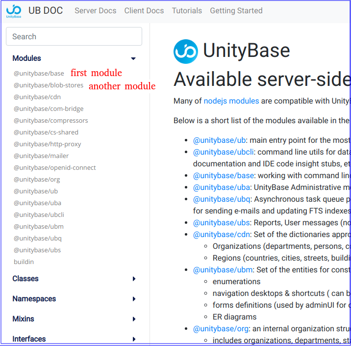

# ub-jsdoc

Documentation template theme for JSDoc 3 based on [Vue server side rendering](https://ssr.vuejs.org/).
Inspired by [godoc](https://godoc.org/golang.org/x/tools/cmd/godoc).

 - support for multiple modules:  
 


 - build-in full text search across all available modules:
 


 - responsive design (mobile screen):
  


Live sample is a [UnityBase framework documentation](https://unitybase.info/api/index.html)

## Features

- Designed for a framework with many modules inside
- Full Text Search with rank
- Links to [MDN](https://developer.mozilla.org/en-US/docs/Web/JavaScript/Reference/Global_Objects) for a standard built-in objects
- Click on member name will navigate to source
- Compact layout for members
- Responsive design
- In case @module marked as a member of other module using `@memberOf module:parentModule` it does not appear in navigation panel
- Click on anchor to copy link of any member to clipboard 


## Uses

- [Vue server side rendering](https://ssr.vuejs.org/)
- [flexsearch](https://github.com/nextapps-de/flexsearch)
- [markdown-it](https://github.com/markdown-it/markdown-it)


## Install

```bash
$ npm i ub-jsdoc
```

For simple Cross-module navigation replace a js-doc `templateHelper.js` with `templateHelper.js-patched`

## Usage

Clone repository to your designated `jsdoc` template directory, then:

```bash
$ jsdoc entry-file.js -t path/to/ub-jsdoc
```

### Node.js Dependency

In your projects `package.json` file add a generate script:

```json
"script": {
  "generate-docs": "node_modules/.bin/jsdoc --configure .jsdoc.json --verbose"
}
```

In your `.jsdoc.json` file, add a template option.

```json
"opts": {
  "template": "node_modules/ub-jsdoc"
}
```

### Markdown
Used [markdown-it](https://github.com/markdown-it/markdown-it) and plugins:
 - [markdown-it-anchor](https://www.npmjs.com/package/markdown-it-anchor)
 - [markdown-it-table-of-contents](https://www.npmjs.com/package/markdown-it-table-of-contents)
   Use `[[toc]]` tag in markdown to add table-of-content block
 - [markdown-it-emoji](https://www.npmjs.com/package/markdown-it-emoji)
 - [markdown-it-mermaid-plugin](https://github.com/DCsunset/markdown-it-mermaid-plugin)
   

### Extend
You can easy extend generations with you own docs. 
Just use `renderFile` function.
```js
module.exports = () => {
  const renderFile = require('./vueRender')
  renderFile(props,
    'path/to/vue/template',
    'path/to/html/template',
    'output/path')
}
```
Then add path to file in `extends` in your jsdoc config.
```json
"extends": [
      "path/to/module"
    ]
```

### Example JSDoc Config

```json
{
  "tags": {
    "allowUnknownTags": true,
    "dictionaries": [
      "jsdoc"
    ]
  },
  "source": {
    "include": [
      "lib",
      "package.json",
      "README.md"
    ],
    "includePattern": ".js$",
    "excludePattern": "(node_modules/|docs)"
  },
  "plugins": [
    "plugins/markdown",
    "./ub-jsdocs/plugins/sripPFromDescription",
    "./packages/ub-jsdocs/plugins/memberOfModule.js"
  ],
  "templates": {
    "cleverLinks": true,
    "monospaceLinks": false,
    "buildInURL": "https://developer.mozilla.org/en-US/docs/Web/JavaScript/Reference/Global_Objects/",
    "buildins": [
      "array",
      "arraybuffer",
      "boolean",
      "date",
      "error",
      "function",
      "json",
      "number",
      "object",
      "regexp",
      "string",
      "null"
    ],
    "smallSourceLink": true,
    "hideAuthor": true,
    "stylesheet": "styles/ub-jsdoc.css",
    "googleAnalytics": "yourGAAccount",
    "default": {
      "outputSourceFiles": true,
      "staticFiles": {
        "include": [
          "./pathToYourTutorialFolder"
        ],
        "excludePattern": "\\.md$"
      }
    }
  },
  "opts": {
    "destination": "./docs/",
    "encoding": "utf8",
    "private": true,
    "recurse": true,
    "template": "./node_modules/ub-jsdoc",
    "tutorials": "./pathToYourTutorialFolder"
  },
  "extendedConfig": {
    "navbar": {
      "logo": {
        "img": "https://unitybase.info/img/UB-logo.png",
        "href": "index.html"
      },
      "nav": [
        {
          "href": "server-v5/index.html",
          "name": "Server Docs"
        },
        {
          "href": "ubpub-v5/index.html",
          "name": "Client Docs"
        },
        {
          "href": "server-v5/tutorialIndex.html",
          "name": "Tutorials"
        },
        {
          "href": "gettingstarted/index.html",
          "name": "Getting Started"
        }
      ]
    },
    "extends": [
      "./src/generators/gettingStarted",
      "./src/generators/mainDocPage"
    ]
  }
}
```

## License

Licensed under the Apache2 license.
