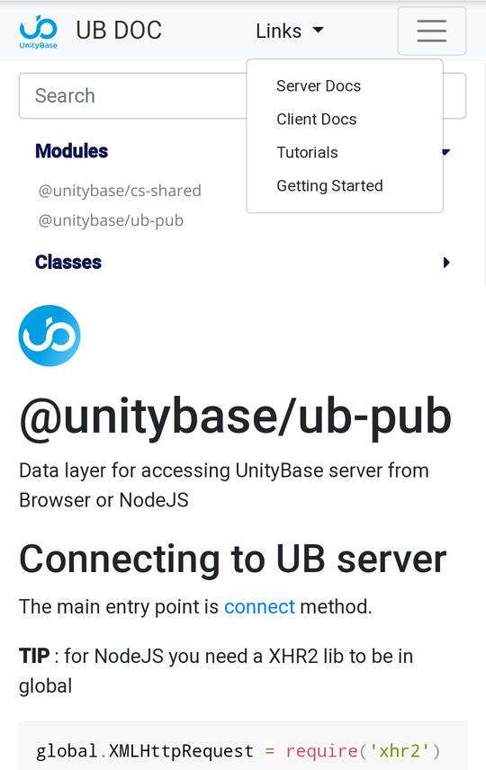

# ub-jsdoc

Documentation template theme for JSDoc 3 based on [minami](https://github.com/Nijikokun/minami) theme.
Inspired by [godoc](https://godoc.org/golang.org/x/tools/cmd/godoc)




Live sample is a [UnityBase framework documentation](https://unitybase.info/api/serverNew/)

## Features

- Designed for a framework with many modules inside
- Partial navigation
- Full Text Search with rank
- Cross-module navigation using {@link ClassName} instead of {module:ModuleName.ClassName}
- Links to [MDN](https://developer.mozilla.org/en-US/docs/Web/JavaScript/Reference/Global_Objects) for a standard built-in objects
- Click on member name will navigate to source
- Compact layout on members
- Responsive design

## Uses

- [lunr Full Text Search](http://lunrjs.com/)
- [the Taffy Database library](http://taffydb.com/)
- [Underscore Template library](http://documentcloud.github.com/underscore/#template)


## Install

```bash
$ npm install --save-dev ub-jsdoc
```

For simple Cross-module navigation replace a js-doc `templateHelper.js` with `templateHelper.js-patched`

## Usage

Clone repository to your designated `jsdoc` template directory, then:

```bash
$ jsdoc entry-file.js -t path/to/ub-jsdoc
```

### Node.js Dependency

In your projects `package.json` file add a generate script:

```json
"script": {
  "generate-docs": "node_modules/.bin/jsdoc --configure .jsdoc.json --verbose"
}
```

In your `.jsdoc.json` file, add a template option.

```json
"opts": {
  "template": "node_modules/ub-jsdoc"
}
```

### Example JSDoc Config

```json
{
    "tags": {
        "allowUnknownTags": true,
        "dictionaries": ["jsdoc"]
    },
    "source": {
        "include": ["lib", "package.json", "README.md"],
        "includePattern": ".js$",
        "excludePattern": "(node_modules/|docs)"
    },
    "plugins": [
        "plugins/markdown",
	"./ub-jsdocs/plugins/sripPFromDescription",
	"./packages/ub-jsdocs/plugins/memberOfModule.js"
    ],
    "templates": {
        "cleverLinks": true,
        "monospaceLinks": false,

		"buildInURL": "https://developer.mozilla.org/en-US/docs/Web/JavaScript/Reference/Global_Objects/",
		"buildins": ["array", "arraybuffer", "boolean", "date", "error", "function", "json", "number", "object", "regexp", "string", "null"],
		"smallSourceLink": true, 
		"hideAuthor": true, 
		"stylesheet": "styles/ub-jsdoc.css",
		"googleAnalytics": "yourGAAccount",  
        "default": {
            "outputSourceFiles": true,
			"staticFiles": {
				"include": ["./pathToYourTutorialFolder"],
				"excludePattern": "\\.md$"
			}
		}
    },
    "opts": {
        "destination": "./docs/",
        "encoding": "utf8",
        "private": true,
        "recurse": true,
        "template": "./node_modules/ub-jsdoc",
	"tutorials": "./pathToYourTutorialFolder"
    }
}
```

## License

Licensed under the Apache2 license.